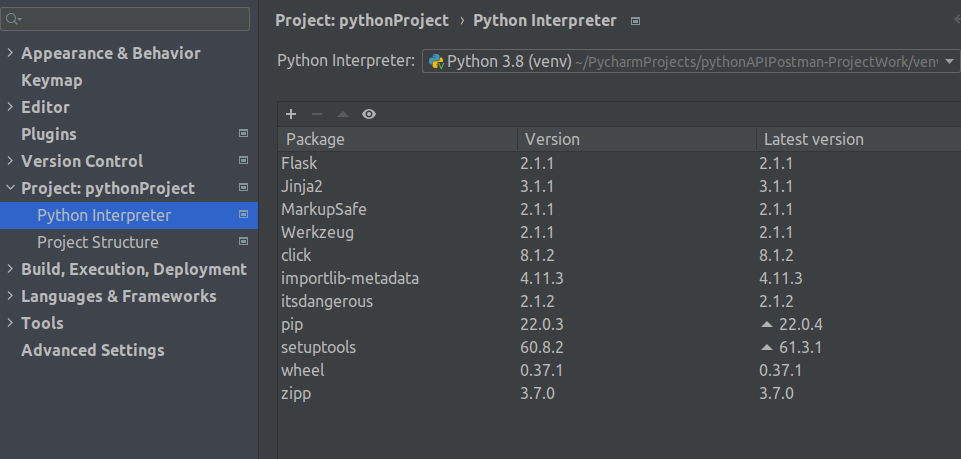
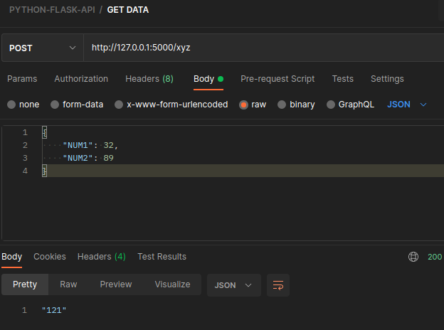

# API INTEGRATION WITH PYTHON FLASK

FLASK IS A LIBRARY THAT ALLOWS PYTHON PROGRAMS
TO WORK WITH API REQUEST.

**Flask Install:**
https://www.leighton.com/blog/create-a-flask-api-part-one

install flask

```commandline
pip install flask
```
Then Follow,

[Stack Overflow Solution](https://stackoverflow.com/a/33920159)

Install Flask package in Python Interpreter:



we simply need to create a new instance of flask

**test.py**
```py
from flask import Flask, request, jsonify

# create instance of Flask object
app = Flask(__name__)

# define a route with method GET
app.route('/', methods=['GET'])

def print_data():
    # return JSON with message
    return jsonify(message='hello world')

if __name__ == '__main__':
    app.run()
```

#### Use of jsonify package
jsonify is a function in Flask's flask. json module. jsonify converts data to JavaScript Object Notation (JSON) format, wraps it in a Response object with the application/json mimetype.

**test.py**

```pycon
from flask import Flask, request, jsonify

# create instance of Flask object
app = Flask(__name__)

# define a route endpoint as /xyz
@app.route('/xyz', methods=['GET', 'POST'])
def test():
    if request.method == 'POST':
        a = request.json['NUM1']
        b = request.json['NUM2']
        result = a + b
    # return JSON with message
    return jsonify(str(result))

# define a new route with different endpoint
@app.route('/abc', methods=['POST'])
def test1():
    if request.method == 'POST':
        a = request.json['NUM3']
        b = request.json['NUM4']
        result = a + b
    return jsonify(str(result))

if __name__ == '__main__':
    # run the app
    app.run()

```

### Run POST Request in postman 



